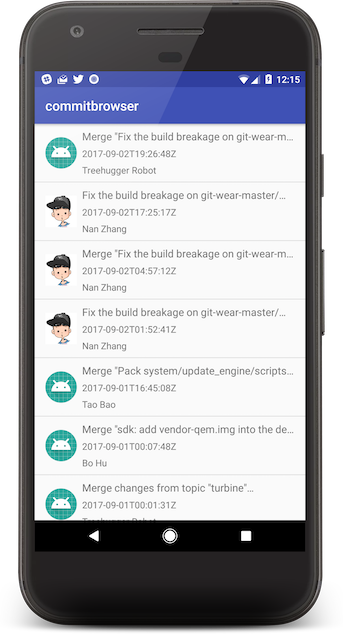

# Saving UI state with ViewModel SavedState and Dagger

This repository contains a sample project that demonstrate the topic discussed in [my article about
ViewModel SavedState module](https://proandroiddev.com/saving-ui-state-with-viewmodel-savedstate-and-dagger-f77bcaeb8b08),
which part of the Android architecture lifecycle components.

## Saved state use cases in the sample

To simulate a process stop, switch to Logcat and at the lefthand corner press the Stop button to stop the process while making sure that
the right process is selected in the dropdown box.

### Commit List screen

You will notice that `CommitListViewModel` is making use of `SavedStateHandle` to save the last seen page in the list.
If the app recovers from a process stop, the handle will load the last seen page. We then load the data up to that page.

### Commit Detail screen

In this case, we're saving the state of the whole commit response object so that the next time the app recovers from a
process stop, it will restore that last commit response object and will skip making a request to Github.

When you launch the app, pay attention to the logs in Logcat. You will see that when the activity is started for the first time, it will make the request
and then store the result in `SavedStateHandle` that is passed to `CommitDetailViewModel`. Then navigate away from the activity by simply
going to the home screen and then navigate back. You'll see in the logs that the previously stored response is loaded from
`SavedStateHandle` - indicating that the state has been restored after process death.

## Libraries and architecture

The app is utilizing the MVVM design pattern for the UI with the help of the following libraries:

* AndroidX
* Architecture Components - ViewModel, Lifecycle, Navigation
* Material components library
* Constraint layout
* Retrofit2 + OkHttp
* Moshi
* Dagger2
* Timber
* Glide
* Kotlin coroutines
* Epoxy

## License

Copyright 2019 Nimrod Dayan nimroddayan.com

   Licensed under the Apache License, Version 2.0 (the "License");
   you may not use this file except in compliance with the License.
   You may obtain a copy of the License at

       http://www.apache.org/licenses/LICENSE-2.0

   Unless required by applicable law or agreed to in writing, software
   distributed under the License is distributed on an "AS IS" BASIS,
   WITHOUT WARRANTIES OR CONDITIONS OF ANY KIND, either express or implied.
   See the License for the specific language governing permissions and
   limitations under the License.
